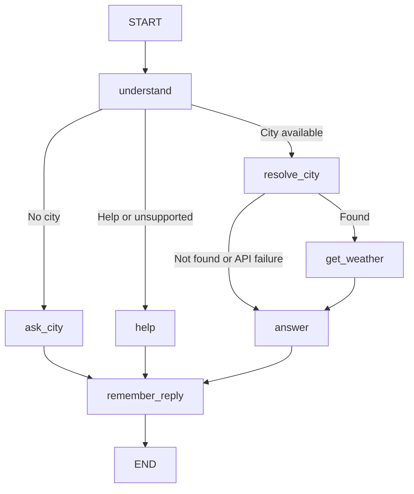

# Weather Chat — a beginner's LangGraph POC

A real chat UI → FastAPI endpoint → LangGraph workflow → Open-Meteo weather API.
No API key, model account, Node.js, or frontend build is needed. Python 3.11+ recommended; tested with Python 3.12.

**This is a rule-based conversational workflow, not an LLM-powered agent.** It teaches state, nodes, edges, conditional routing, message reducers, checkpointing, threads, async API calls, and error paths. The weather requests are real. Tests substitute controlled API responses.

## Start on Windows (PowerShell, including VS Code terminal)

Extract the ZIP and open its `weather-chatbot` folder in VS Code. Run inside that folder:

```powershell
py -m venv .venv
.venv\Scripts\python.exe -m pip install -r requirements.txt
.venv\Scripts\python.exe -m uvicorn app:app --reload
```

No virtual-environment activation or PowerShell policy changes are needed.
Open http://127.0.0.1:8000 in your browser.
Interactive API docs: http://127.0.0.1:8000/docs.
Stop the server with Ctrl+C. `--reload` restarts the server on file edits and clears memory.

## Start on macOS / Linux

```bash
python3 -m venv .venv
.venv/bin/python -m pip install -r requirements.txt
.venv/bin/python -m uvicorn app:app --reload
```

## Try these conversations

1. `Will it rain tomorrow?` → the bot asks for a city.
2. `Hyderabad, India` → fetches tomorrow's forecast, preserving the requested day.
3. `Weather in London today` → changes city and day.
4. `What about tomorrow?` → remembers London.
5. `Should I carry an umbrella?` → today's forecast for London.
6. `Weather in notacity` → demonstrates the city-not-found branch.
7. Click **New chat**, then ask `What about tomorrow?` → asks for a city again.

The right panel shows the actual nodes executed and selected state fields. New chat starts a fresh thread; it does not erase previous threads from server memory. The browser's current thread lasts only while this page stays open. Refresh starts a new thread.

## Files — read in this order

| File | Purpose |
|---|---|
| `app.py` | Receives HTTP chat messages and invokes the graph. |
| `graph.py` | Defines shared state, every node, and every connection. |
| `weather_api.py` | Makes real geocoding and forecast HTTP requests. |
| `static/index.html` | Chat interface using plain HTML/CSS/JavaScript. |
| `tests/test_chat.py` | Exercises the endpoint and real graph with mocked external services. |
| `requirements.txt` | Tested direct dependency versions. |

## Follow one request

The browser sends `POST /api/chat` with `message` and optionally `thread_id`.
FastAPI validates it. On the first request it creates a UUID conversation ID.
`graph.ainvoke()` gets the new HumanMessage and that thread ID. The checkpointer restores existing state for follow-up turns.



The graph ends on each chat turn. A follow-up begins another run on the same thread. This example does not use an internal agent/tool loop or `interrupt()`; asking for a city is a normal reply followed by a new HTTP request.

## Every function explained

| Function | Why it exists |
|---|---|
| `home()` | Serves the chat page from the same origin as the API. |
| `chat()` | Validates the message, chooses a thread, serializes requests per thread, calls LangGraph, returns reply and debug data. |
| `understand()` | Uses small regular-expression rules to identify a city/day and select a branch; clears stale per-turn API results. |
| `ask_city()` | Produces a clarification and marks the conversation as waiting for a city. |
| `help_user()` | Explains supported messages. |
| `resolve_city()` | Converts the city into coordinates using `find_city()` and handles failures. |
| `get_weather()` | Fetches and validates forecast values without inventing missing data. |
| `answer()` | Formats daily temperature, precipitation probability, source, and umbrella advice, or a service error. |
| `remember_reply()` | Appends the bot's response to conversation history. |
| `build_graph()` | Registers nodes and edges, then compiles with an in-memory checkpointer. |
| `find_city()` | Calls Open-Meteo's geocoding endpoint. |
| `fetch_forecast()` | Calls its forecast endpoint using latitude and longitude. |
| Frontend `send()` | Posts the message, displays the reply, and updates the debug panel. |
| Frontend `bubble()` | Safely renders message text without interpreting it as HTML. |
| Frontend `start()` | Clears the screen and starts a new conversation. |

## Terms mapped to real code

- **State**: `ChatState`, the shared data (city, day, messages, forecast, etc.).
- **Schema**: the TypedDict declaration; type hints help readers/editors but do not validate at runtime. The API's Pydantic model validates HTTP input.
- **Node**: one registered function, such as `resolve_city`.
- **Edge**: `add_edge()` always connects to a fixed next node.
- **Conditional edge/router**: `add_conditional_edges()` chooses a destination from state. The `lambda` is a small anonymous routing function.
- **Reducer**: `add_messages` combines new messages with history. Ordinary fields replace their previous values. Trace resets each turn.
- **Message**: HumanMessage for user input; AIMessage for our generated reply. AIMessage is a data format here and does not imply an LLM was called.
- **Compile**: prepares an executable workflow; does not train a model.
- **Async invoke**: `await graph.ainvoke(...)` runs the workflow while allowing other tasks to proceed during network waits.
- **Checkpoint/checkpointer**: saved execution state and the component maintaining it (`InMemorySaver`).
- **Thread**: one conversation, keyed by `thread_id`; separate threads do not share city/history.
- **Tool/API integration**: the Python weather functions call external services. They are called by fixed graph logic, not selected by an LLM.

## Call the API directly

In the Swagger page `/docs`, use POST `/api/chat` → Try it out:

```json
{"message": "Weather in Hyderabad, India"}
```

Copy the returned `thread_id` into a follow-up:

```json
{"message": "What about tomorrow?", "thread_id": "PASTE-RETURNED-UUID-HERE"}
```

The response includes `reply`, `thread_id`, `nodes_visited`, and a small `state` object.
A missing ID starts a new conversation. Blank/oversized messages and invalid UUIDs return HTTP 422.

## Tests

```powershell
.venv\Scripts\python.exe -m pip install pytest
.venv\Scripts\python.exe -m pytest -q
```

Linux/macOS: replace `.venv\Scripts\python.exe` with `.venv/bin/python`.
Eight tests cover clarification and day retention, follow-ups, city changes, thread isolation, unknown cities, upstream failure, missing forecast values, validation, UI delivery, and help routing.

## Deliberate limits

- English patterns, today/tomorrow, Celsius only. This is not general natural-language understanding. For reliable parsing use `Weather in CITY today/tomorrow`, `What about tomorrow?`, or a bare city name.
- Geocoding takes the first match and always displays the resolved location. Add a country to reduce ambiguity; a production app should offer location selection.
- Umbrella advice uses an illustrative 40% daily maximum precipitation-probability threshold. Precipitation includes rain and snow; it is not a guarantee or a model-generated prediction.
- A follow-up without a day defaults to today, except when supplying a city after a clarification, where the pending day is kept.
- Memory, checkpoints, locks, and message history live in one process. No pruning, durable database, authentication, multi-worker support, or production rate limiting. Run locally as supplied, not as a public service.
- Checkpointing does not automatically provide long-term memory or unlimited model context. This demo has no LLM, streaming, internal loop, multi-agent system, or human-approval interrupt.
- Only external weather requests need internet access. Outages are reported as friendly replies. No fallback fabricates weather.

## Next learning steps

1. Add a `units` field and support Fahrenheit.
2. Add SQLite/Postgres checkpointing for restart-safe memory.
3. Replace `understand()` with an LLM producing validated `{city, day, intent}` data, while retaining fixed weather API nodes. This requires a separate hosted-model account or a local model runtime.
4. Build a separate model → tool → model loop to learn actual model-directed tool calling.

## Official references and attribution

- [LangGraph graph concepts](https://docs.langchain.com/oss/python/langgraph/graph-api)
- [LangGraph memory](https://docs.langchain.com/oss/python/langgraph/add-memory)
- [Open-Meteo forecast API](https://open-meteo.com/en/docs)
- [Open-Meteo geocoding API](https://open-meteo.com/en/docs/geocoding-api)
- [Open-Meteo terms/pricing](https://open-meteo.com/en/pricing)
- [GeoNames](https://www.geonames.org/)

Open-Meteo's free hosted API is for non-commercial use within its limits, with no key required. Weather data requires attribution (CC BY 4.0); location data is based on GeoNames. Check current terms before commercial deployment. The chat page and weather replies include attribution.
